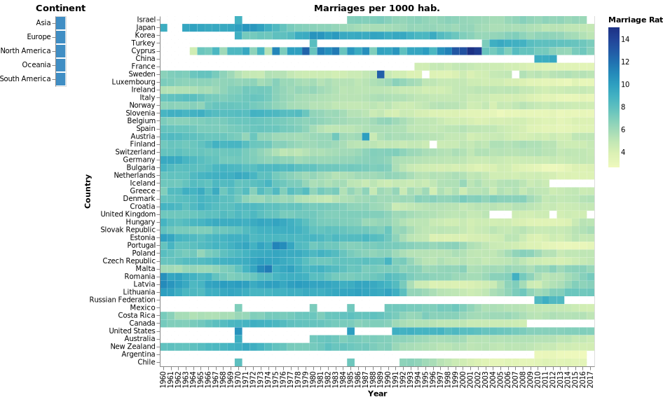
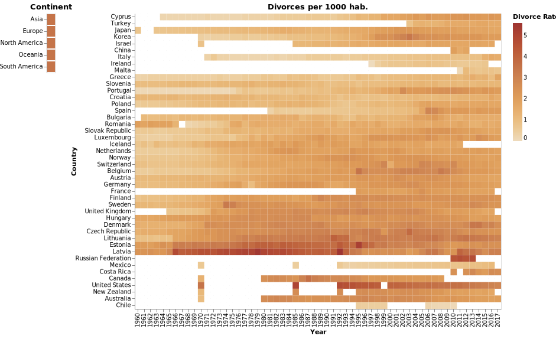
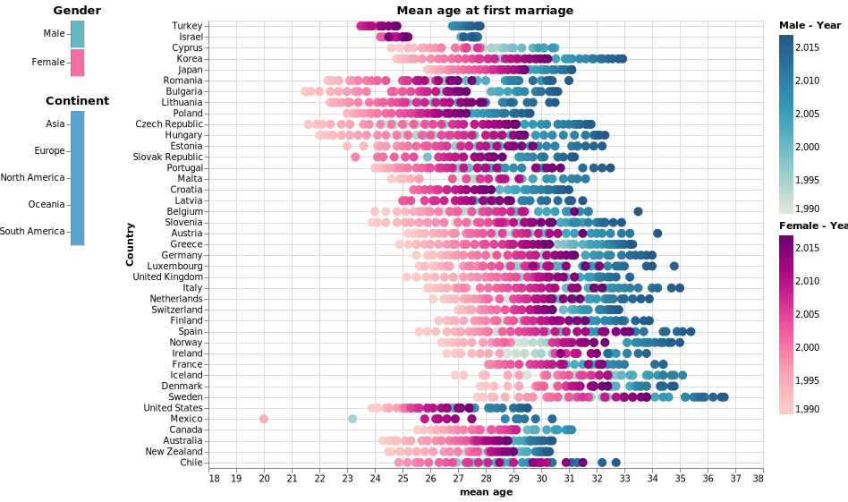

# Trabalho Final

Essa pasta contém os arquivos criados para o trabalho final da disciplina de [Visualização de Informação](https://emap.fgv.br/disciplina/mestrado/visualizacao-de-informacao) do mestrado acadêmico em Matemática Aplicada da [EMAP/FGV](https://emap.fgv.br/mestrado/modelagem-matematica).

## O que aprendi?

> - Como criar e estruturar um projeto de visualização (muito bem explicado no livro do Andy Kirk, [Data Visualization](https://www.amazon.com/Data-Visualisation-Handbook-Driven-Design/dp/1473912148)). 
> - Como escolher e codificar informação em elementos gráficos (tamanho, forma, cor, etc.) de maneira lógica para realçar padrões nos dados (muito presente na leitura do livro do Jacques Bertin, [Semiology of Graphics](https://www.amazon.com.br/Semiology-Graphics-Diagrams-Networks-Maps/dp/1589482611)).
> - Como estruturar o processo criativo e criar gráficos que transmitem ideias de maneira clara e intuitiva.  
> - Conhecimentos sobre a percepção humana (sistemas sensoriais) e a levar isso em consideração no momento de codificar a informação em um gráfico. 

## Lista de arquivos:

> - **data:** Nessa pasta estão presentes os arquivos de dados (`.xlsx` e `.csv`) utilizados para a construção dos gráficos.  
> - **viz:** Contém todas as visualizações criadas para o trabalho final. A versão estátida dos gráficos estão nos arquivos com extensões `.svg`e `.png`. A versão dinâmica é apresentada em arquivos `.html`
> - **TBFinal_proposta.ipynb:** Proposta do trabalho final apresentada e aprovada em sala de aula. 
> - **TBFinal_datasets.ipynb:** Código para limpeza e estruturação dos datasets usados para criação dos gráficos.  
> - **TBFinal_visualizacoes.ipynb:** Código para criação dos gráficos. 
> - **Trabalho_Final_Visualizacao_de_Dados.pdf:** Relatório em pdf com comentários sobre cada visualização e referências usadas como inspiração (**Obs:** esse arquivo contém _hyperlinks_ que podem não aparecer devidamente se este documento for visualizado em sua versão online).

## Lista de gráficos:

Abaixo segue a versão estática dos gráficos (para visualização sem a necessidade de clonar ou fazer o download deste repositório). O título de cada gráfico contém um _hyperlink_ conectado à sua versão dinâmica (em `.html`). Para visualizá-los adequadamente, é necessário clonar ou fazer o download deste repositório.   

> - **Gráfico 1:** [Something borrowed, something...](./viz/marriages.html)  
	Visualização das taxas de casamento (número de casamentos a cada 1000 habitantes) para 45 países membros da OECD, de 1960 a 2017.  

> - **Gráfico 2:** [Now and for... ever?](./viz/divorces.html)  
	Visualização das taxas de divórcio (número de divórcios a cada 1000 habitantes) para 45 países membros da OECD, de 1960 a 2017. 

> - **Gráfico 3:** [Em média, pessoas estão casando mais tarde.](./viz/mean_age.html)  
	Idade média na qual homens e mulheres casaram-se pela primeira vez para 45 países membros da OECD, de 1990 a 2017.   

-----

