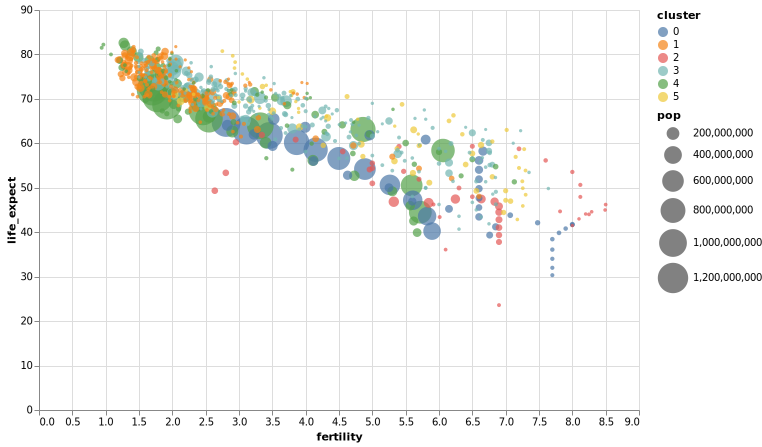

# Homework 1

Pasta com a solução do *Homework 1*.

## Exercício proposto:

Implementar um scatter plot em uma linguagem de gramática de gráficos (opções: *ggplot*, *altair*, *vega*, *vega-lite* ou *D3.js*). 

O gráfico deveria ser baseado nesse [exemplo](https://observablehq.com/@uwdata/data-types-graphical-marks-and-visual-encoding-channels), inspirado na apresentação feita por Hans Rosling em um [TED Talk](https://www.youtube.com/watch?v=hVimVzgtD6w) no ano de 2007.

## Resultado: 

Todo o código criado nessa implementação está no arquivo [Exercicio_1.ipynb](./Exercicio_1.ipynb).

Abaixo, é exibida a versão estática da replicação gráfica do gapminder. A versão dinâmica, em `HTML`, é apresentada no arquivo [gapminder.html](./gapminder.html). 

