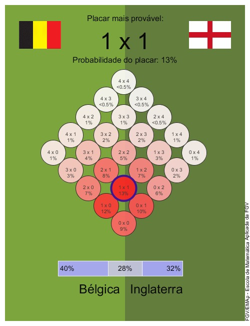
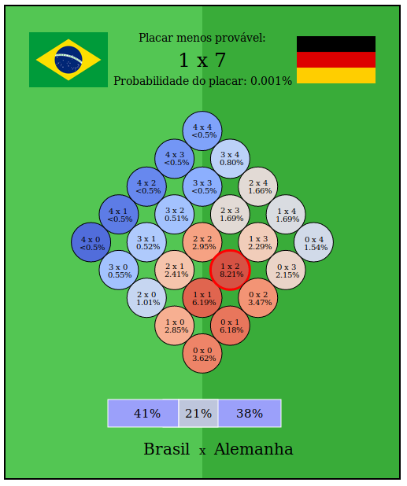

# Homework 2

Pasta com a solução do *Homework 2*.

## Exercício proposto:

Reproduzir a figura abaixo em uma primitiva gráfica de baixo nível (opções: *D3.js*, *svg* ou *canvas*).

 

A minha resposta ao exercício é apresentada a seguir: 

 

## Lista de Arquivos:

> - **brasil.png:** bandeira do Brasil adicionada ao arquivo Exercicio_2.html
> - **germany.png:** bandeira da Alemanha adicionada ao arquivo Exercicio_2.html
> - **reproducao.png:** imagem gerada pelo arquivo Exercicio_2.html (minha resposta ao exercício)
> - **Exercicio_2.html:** código `HTML` escrito como resposta ao exercício. 