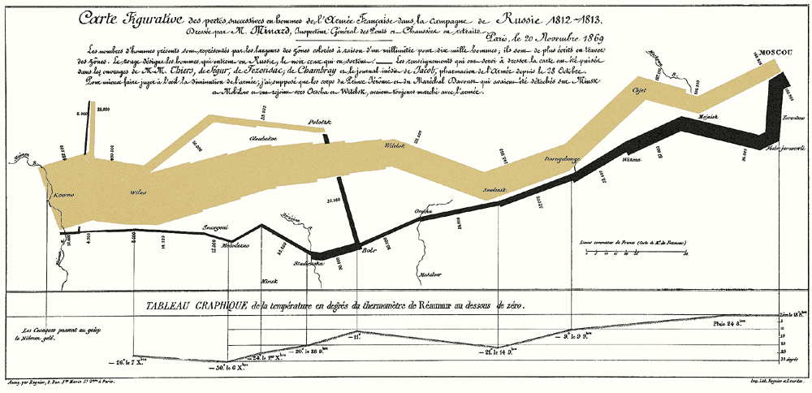
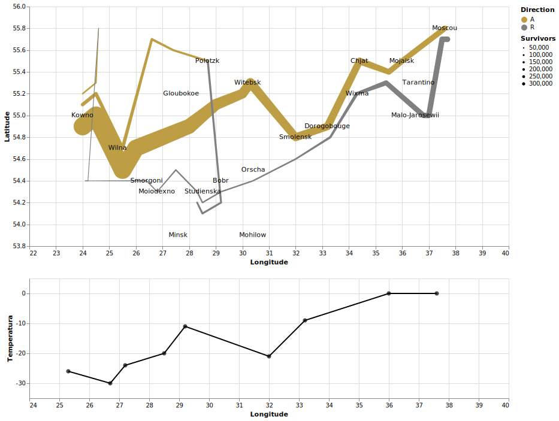

# Homework 3

Pasta com a solução para o *homework 3*.

## Exercício proposto:

 Executar, na ferramenta escolhida, a clássica representação gráfica dos dados das tropas de napoleão até a Russia executado por Minard ([link](https://thoughtbot.com/blog/analyzing-minards-visualization-of-napoleons-1812-march)). Uma solução foi implementada por Wickham como exemplo para o *ggplot2* ([link](https://www.cs.uic.edu/~wilkinson/TheGrammarOfGraphics/minard.txt)). 

 Os dados para a implementação estão disponíveis nesse [link](https://www.cs.uic.edu/~wilkinson/TheGrammarOfGraphics/minard.txt).

 

### Imagem Original:

 

### Imagem Recriada:

## Lista de Arquivos:

> - **Exercicio_3.ipynb:** Notebook com o código em Python 3 proposto como solução do exercício.
> - **troops.csv:** Dataset com informações das tropas de Napoleão.
> - **cities.csv:** Dataset com informações de latitude, longitude e nome das cidades visitadas pelas tropas.
> - **temp.csv:** Informações de temperatura nas cidades visitadas pelas tropas.
> - __Napoleon_Troops_Viz.*:__ Imagem criada como solução para o exercício (nos formatos *.svg* e *.png*). 
